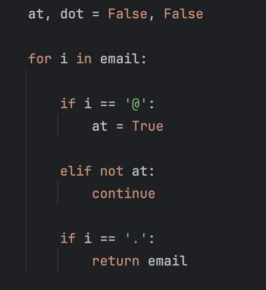
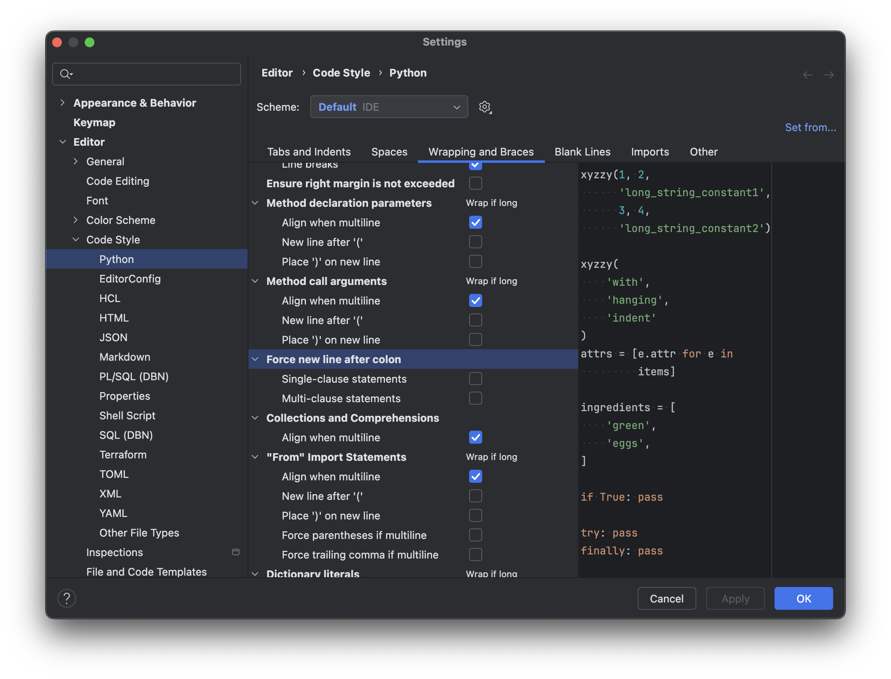

Python을 사용하다 보면 if - else 구문을 한 줄에 이어서 작성하는 경우가 있다.

그런데 Pycharm에서 `cmd + option + l`을 통해 줄정렬을 하면 자꾸 풀려버리곤 한다.

그럴 때는, 설정에 들어가서 Editor > Code Style > Python(원하는 언어) > Wrapping and Braces > Force new line after colon의 두 체크박스를 해제하면 된다.

